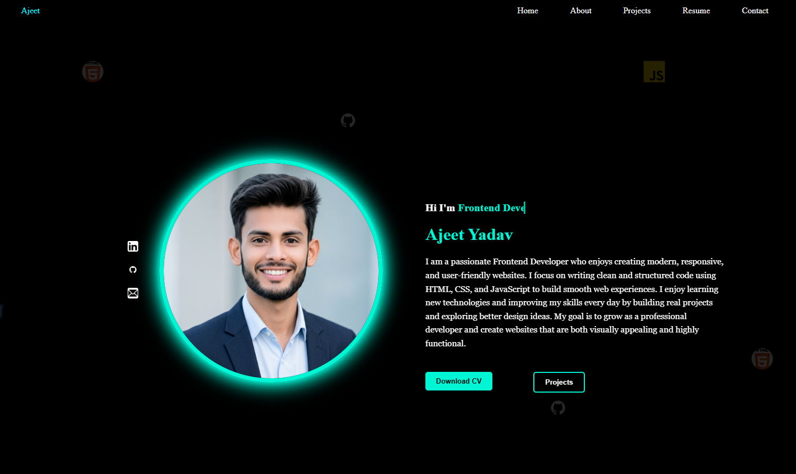
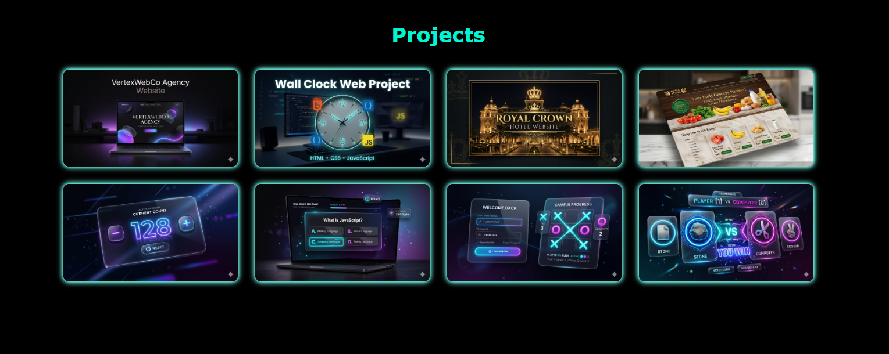

<h1 align="center">🌐 Ajeet Yadav – Developer Portfolio</h1>

<p align="center">
  🚀 Modern, responsive & performance-focused portfolio website  
  Built to showcase frontend skills, real projects, and growth journey.
</p>

<p align="center">
  
  
  
  
  
</p>

---

## 🔗 Live Preview

👉 **Live Website:**  
https://theajeetcodes.github.io/portfolio/

---

## 📸 Preview

<p align="center">
  
  
</p>

---

## 📌 About The Project

This is a **professional developer portfolio website** designed and built to:

- Showcase real-world frontend projects
- Highlight technical skills and UI/UX abilities
- Represent personal brand as a developer
- Demonstrate clean coding & structured development approach

The project is being developed with **incremental commits** to reflect real industry workflow.

---

## 🚀 Tech Stack

- **HTML5** → Structure  
- **CSS3** → Styling & Layout  
- **JavaScript (ES6)** → Interactivity  
- **Git & GitHub** → Version Control  

---

## ✨ Features

- ✅ Fully Responsive Design (Mobile + Desktop)
- ✅ Modern UI/UX Layout
- ✅ Smooth Scrolling Navigation
- ✅ Clean Section-Based Structure
- ✅ Developer-Focused Design
- 🚧 JavaScript Interactions (In Progress)
- 🚧 Animations & Effects (Planned)

---

## 📂 Folder Structure
```
portfolio/
│
├── index.html
│
├── css/
│   └── style.css
│
├── js/
│   └── script.js
│
├── images/
│   ├── preview1.png
│   ├── preview2.png
│   ├── dp1.png
│   ├── html.png
│   ├── css.png
│   ├── js.png
│   ├── github.png
│   ├── linkedin.png
│   ├── email2.png
│   ├── email1.png
│   ├── call.png
│   ├── location.png
│   ├── clock.png
│   ├── counter.png
│   ├── bookmark.png
│   ├── apnastore.png
│   ├── hotel.png
│   ├── vertexwebco.png
│   ├── logingame.png
│   ├── papergame.png
│   ├── quiz.png
│   ├── time.png
│   └── whatsapp.png
│
├── files/
│   └── Ajeet_Yadav_CV.pdf
│
└── README.md
```

---

## 🛠️ Getting Started

### 1️⃣ Clone Repository

```bash
git clone https://github.com/theajeetcodes/portfolio.git
cd portfolio
```

### 2️⃣ Run Locally

Then Open **index.html** in your browser

---

## 📈 Development Workflow

This project follows real-world development practices:

* 🔹 Incremental commits (no fake “complete project” commits)
* 🔹 Clean and scalable structure
* 🔹 Feature-by-feature updates
* 🔹 Continuous UI improvements

---

## 📌 Current Progress

🚧 Portfolio is actively being developed
✔️ Initial structure completed
✔️ Base UI designed
⏳ JavaScript features in progress

---

## 📬 Future Enhancements
* ☀️ Light Mode
* 🎬 Advanced Animations (GSAP / CSS)
* 🔍 Project Filtering System
* ⚡ Performance Optimization
* 🌍 Custom Domain Deployment

---

## 👨‍💻 Author

**Ajeet Yadav**
Frontend Developer

- 📧 Email: ajeetyadavajju88@gmail.com  
- 💻 GitHub: https://github.com/theajeetcodes  
- 💼 LinkedIn: https://www.linkedin.com/in/ajeet-yadav-9339313b3

---

## ⭐ Show Your Support

If you like this project, **give it a ⭐ on GitHub!**
